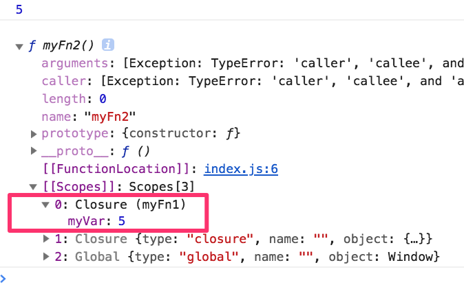
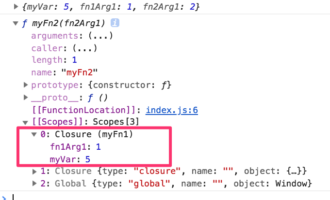
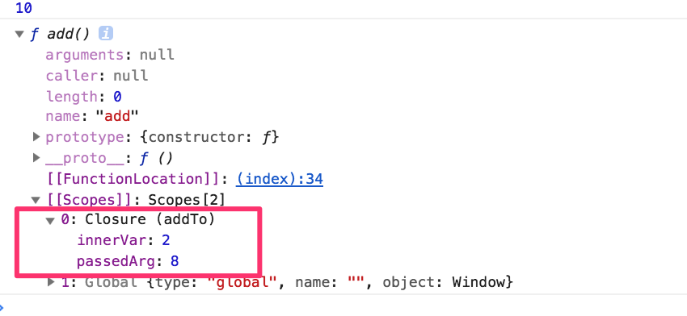
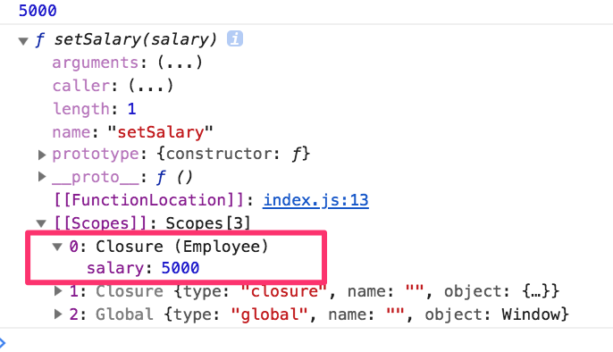
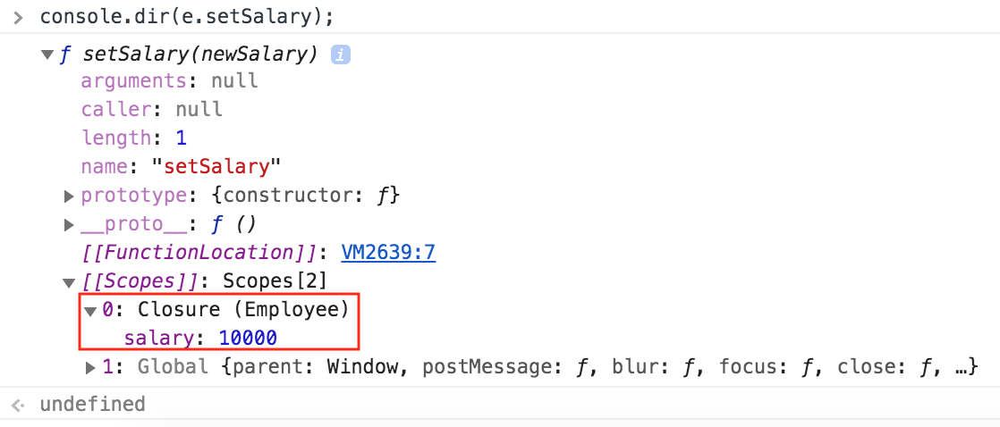

# Closure Scope \(More Detailed\)

## What is Closure ?

When a `fn` returning `another fn` ,

* the `retuningFn` , will **hold its 'environment'**
  * basically the `retuningFn` \(**hold** all the **variables** and **values**\)
  * It `keeps all the required variable` --to execute that `retuningFn`

```javascript
function myFn1() {
  var myVar = 5
  function myFn2() {
    return myVar;
  }
  return myFn2;
}

// Closure:
// 'fn' returning another 'fn' has all its 'environment'
console.log(myFn1()());    // 5  

// is a same
var returnedFn = myFn1();
console.log(returnedFn()); // 5  

// Let's see 'Closure' in the retuned fn
console.dir(returnedFn);
```



Some more addition to the previous example,

```javascript
function myFn1(fn1Arg1) {
  var myVar = 5
  function myFn2(fn2Arg1) {
    return { myVar, fn1Arg1, fn2Arg1 };
  }
  return myFn2;
}

// Closure:
// 'fn' returning another 'fn' has all its 'environment'
console.log(myFn1(1)(2)); //  {myVar: 5, fn1Arg1: 1, fn2Arg1: 2} 


// Let's see 'Closure' in the retuned fn
var returnedFn = myFn1(1);
console.dir(returnedFn);
```



some more advanced

```javascript
var addTo = function(passedArg) {

  var innerVar = 2;

  var add = function() {
    return innerVar + passedArg;
  }

  return add;
};

console.log(addTo(8)()); // 10

console.dir(addTo(8));
```



**Problem1:** it doesn't set the new salary  `[***`**`IMP`**`***]`

```javascript
var Employee = function (nameArg, companyArg, salaryArg) {

  var name = nameArg;
  var company = companyArg;
  var salary = salaryArg;

  var setSalary = function (salary) {
    salary = salary;
  };

  var getSalary = function () {
    return salary;
  };

  return {
    setSalary: setSalary,
    getSalary: getSalary
  };
};


var e = new Employee("Jagadeesh", "P", 5000);
e.setSalary(10000);           // it doesn't set the new salary
console.log(e.getSalary());   // 5000


console.dir(e.setSalary);
```



**fix this:** make the `setSalary` fn work properly

```javascript
var Employee = function (nameArg, companyArg, salaryArg) {

  var name = nameArg;
  var company = companyArg;
  var salary = salaryArg;

  var setSalary = function (newSalary) {
    // 'salary' here always points to 'Closure' scope
    salary = newSalary;
  };

  var getSalary = function () {
    return salary;
  };

  return {
    setSalary: setSalary,
    getSalary: getSalary
  };
};


var e = new Employee("Jagadeesh", "P", 5000);
e.setSalary(10000);           // now it sets the new salary
console.log(e.getSalary());   // 10000


console.dir(e.setSalary);
```



