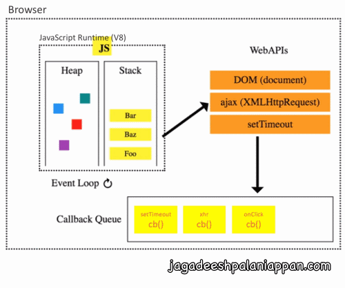
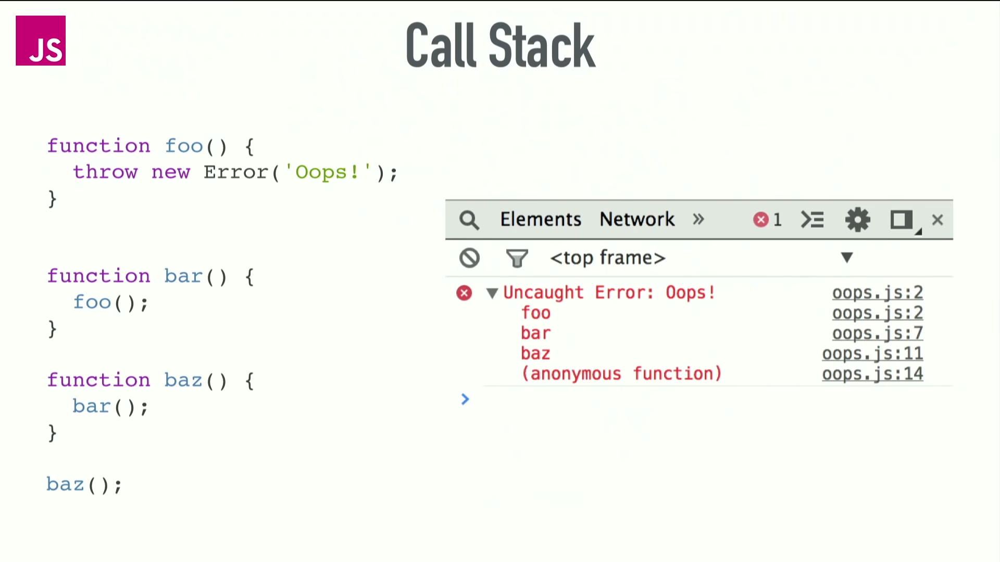

# 1. Event Loop

```javascript
JavaScript is 
    - 'single-threaded', 
    - 'non-blocking', 
    - 'event-driven', 'asynchronous', 'concurrent' language

Browser has 
    - a 'call stack', 
    - an 'event loop', 
    - a 'Task Queue', 'Micro Task Queue',
    - 'Web APIs' (document, XMLHttpRequest, fetch, requestAnimationFrame,..)
    - and 'some other APIs' (Promise,..)


- JavaScript Runtime - can do only 'one thing at a time'
- But browser can do 'more than one thing at a time'

```



```javascript
- When 'JavaScript CallStack' sees the async fn (setTimeout, xhr,..)
- it executes that sync fn and assign the asynchronous task to 'browser/node.js' and does NOT wait for the completion
    - JavaScript CallStack continue executing the other fns / lines
....
....    
- once 'browser/node.js' completes that asynchronous task, it adds that 'callback' into the 'Task Queue'
....
.... 
################################################################
On every 'Event Loop' iteration, 
it looks at
    1. Current Call Stack is "empty"
    2. Micro Task Queue is "empty"
    3. Task Queue has "...some items..." ######<------
    4. Did browser decide to run Render Steps? No
    5. Continue Event Loop 
################################################################

On every 'Event Loop' iteration, 
- if the current CallStack is empty and MicroTaskQueue is empty,
- it takes the "first Task's callback fn" from the 'Task Queue' and executes in the current CallStack

```

```javascript
#### Task: ####
 - setTimeout(..), setInterval(..)
 - XMLHttpRequest, fetch(..)
 - 'click/change/load ...' event
 
 - setImmediate(..)    // Node.js Only
 

#### Micro Task: ####
 - Promise [.then(..), .catch(..) .finally(..)]
 - Object.observe
 
 - process.nextTick    // Node.js Only
```


## Call Stack



#### Synchronous: Simple Code \(Call Stack\)



 



#### Error \(Call Stack\)





#### Maximum \(Call Stack\) exceeded





#### setTimeout \(Call Stack\) 



#### 

#### setTimeout \(Call Stack\)  -Detailed





### setTimeout\(..., 0\) \(Call Stack\) 





### AJAX \(Call Stack\) 






## Event Loop -\(Jag Detailed\):




### 


## Must Watch Videos \[Event Loop\]









### setImmediate\(\) vs nextTick\(\) vs setTimeout\(fn,0\)




