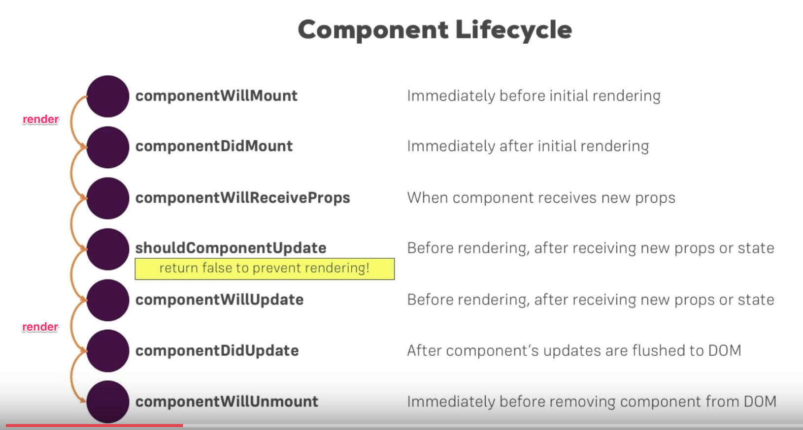
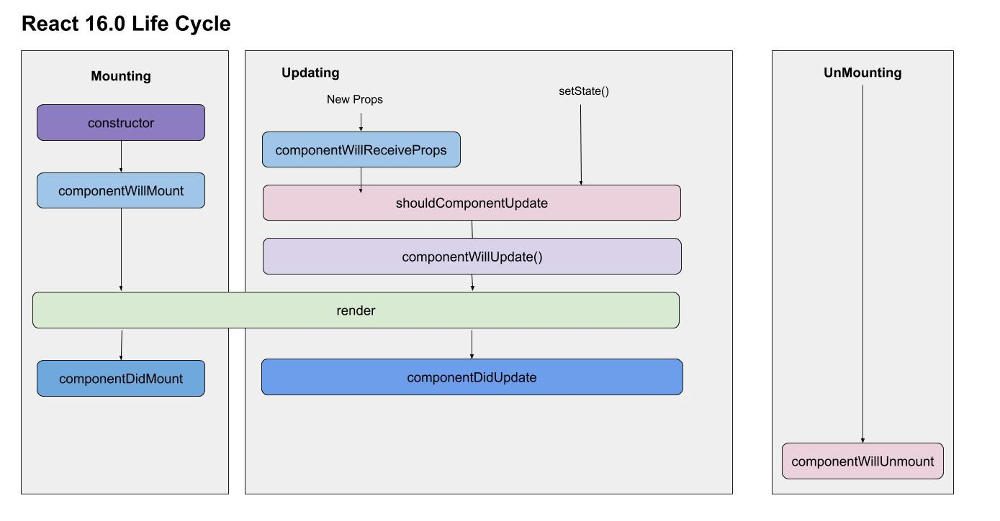
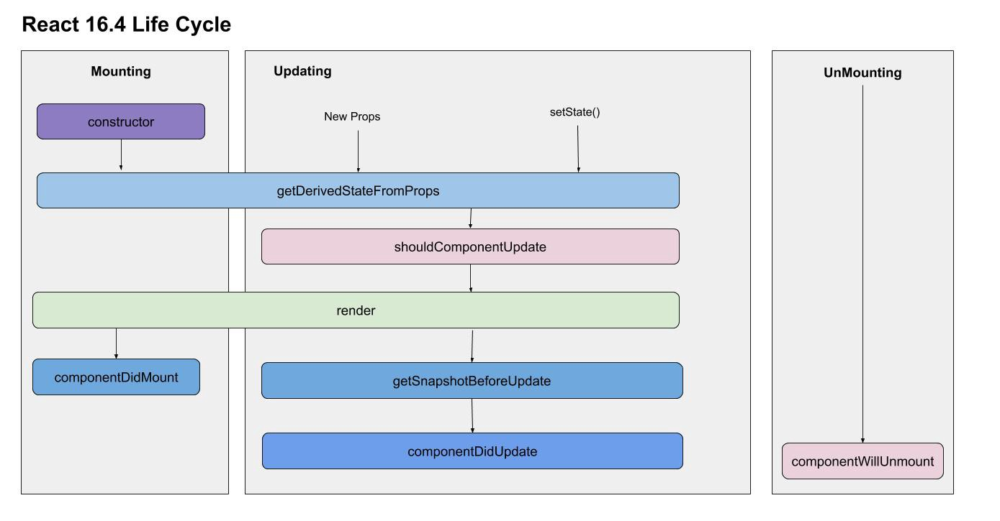
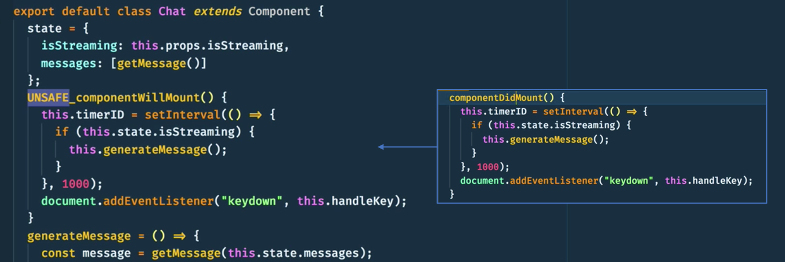
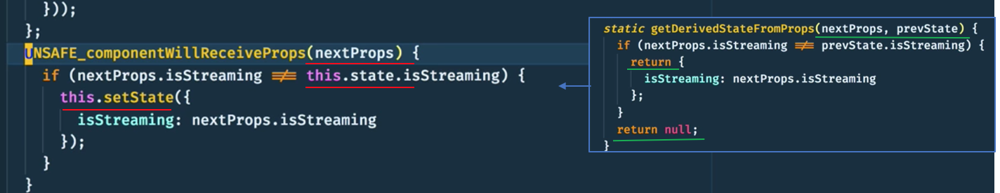
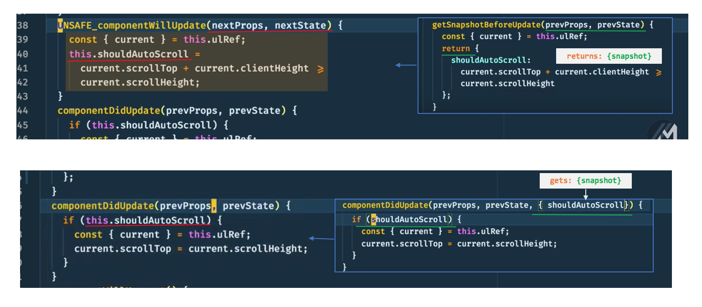
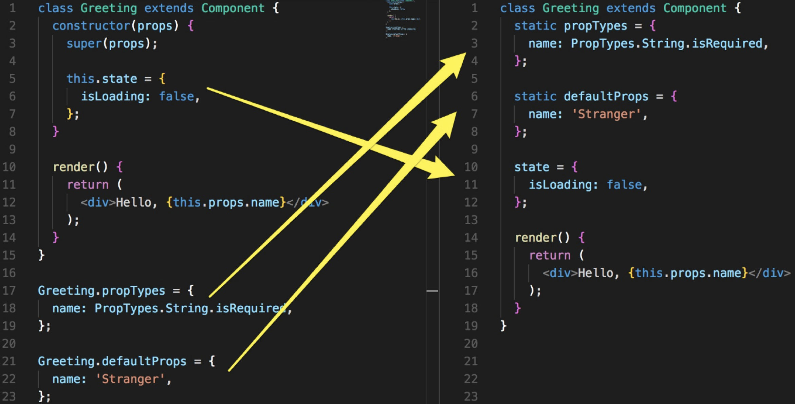
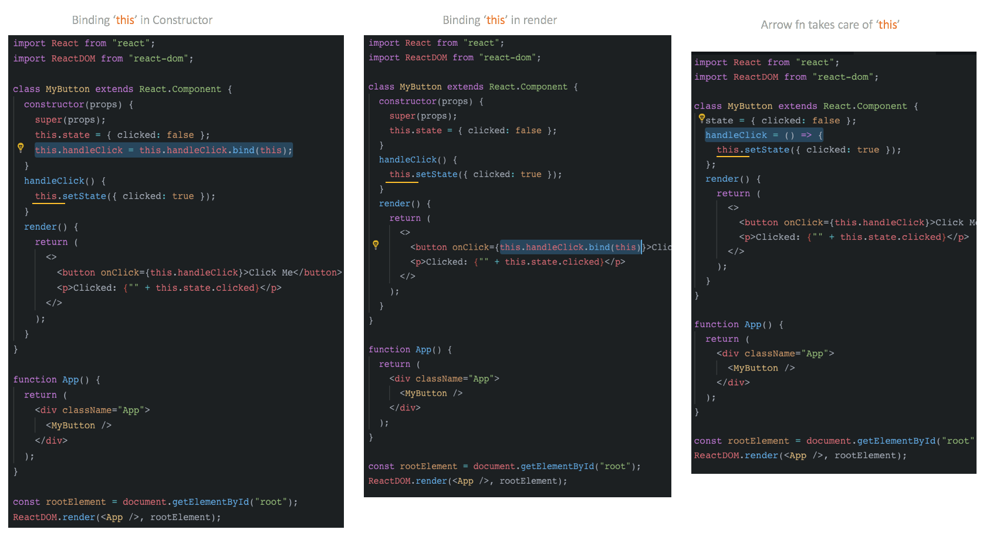

# Quick: React Overview

## React LifeCycle



```csharp

----------------------------------- Keywords -----------------------------------

# Class Component

# Functional Component

----------
# Smart Component
- has a state

# Dump Component
- doesn't have a state

----------
# Container vs Component

# Container

# Component
----------
    
# Higher Order Components vs Mixins

# Higher Order Components (HOCs) vs Render Props vs Hooks

// https://medium.com/simply/comparison-hocs-vs-render-props-vs-hooks-55f9ffcd5dc6
```











| Methods Deprecated in 16.4 | New Methods introduced in 16.4 |
| :--- | :--- |


<table>
  <thead>
    <tr>
      <th style="text-align:left">
        <ol>
          <li>component<b>WillMount</b>()</li>
          <li>component<b>WillReceiveProps</b>()</li>
          <li>component<b>WillUpdate</b>()</li>
        </ol>
      </th>
      <th style="text-align:left">
        <ol>
          <li>getDerivedStateFromProps()</li>
          <li>getSnapshotBeforeUpdate()</li>
        </ol>
      </th>
    </tr>
  </thead>
  <tbody></tbody>
</table>### Aliases Methods

1. ~~**componentWillMount**\(\)~~ **→**  UNSAFE\_componentWillMount\(\)
2. ~~**componentWillReceiveProps**\(\)~~ **→**  UNSAFE\_componentWillReceiveProps\(\)
3. ~~**componentWillUpdate**\(\)~~ **→** UNSAFE\_componentWillUpdate\(\)
4. React 16.3 All old methods, aliases and new lifecycle will work.
5. React 16.4 All old methods, aliases and new lifecycle will work, 
   * but old methods will give deprecation warning in dev mode.
6. **React 17.0** Only aliases and new lifecycle will work.



1.component**WillMount** ---&gt; **\*\*component**DidMount\*\*



2.component**WillReceieveProps** ---&gt; **get**Derived**State**FromProps



3.component**WillUpdate** ---&gt; **getSnapshot**BeforeUpdate

* whatever **getSnapshotBeforeUpdate** fn returns 
* we can get that `snapshot` value in **componentDidUpdate** fn as a 3rd arg





## React Code Styles












