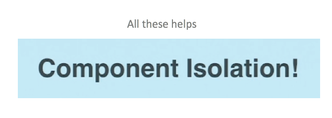

# React Performance







### shouldComponentUpdate





#### How do I implement `shouldComponentUpdate`? <a id="how-do-i-implement-shouldcomponentupdate"></a>

You can wrap a function component with `React.memo` to shallowly compare its props:

```text
const Button = React.memo((props) => {
  // your component
});
```

It’s not a Hook because it doesn’t compose like Hooks do. `React.memo` is equivalent to `PureComponent`, but it only compares props. \(You can also add a second argument to specify a custom comparison function that takes the old and new props. If it returns true, the update is skipped.\)

`React.memo` doesn’t compare state because there is no single state object to compare. But you can make children pure too, or even [optimize individual children with `useMemo`](https://reactjs.org/docs/hooks-faq.html#how-to-memoize-calculations).

####  <a id="how-to-memoize-calculations"></a>



## React Scalability









