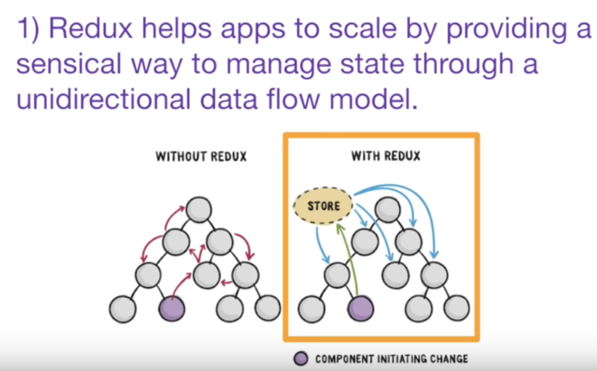
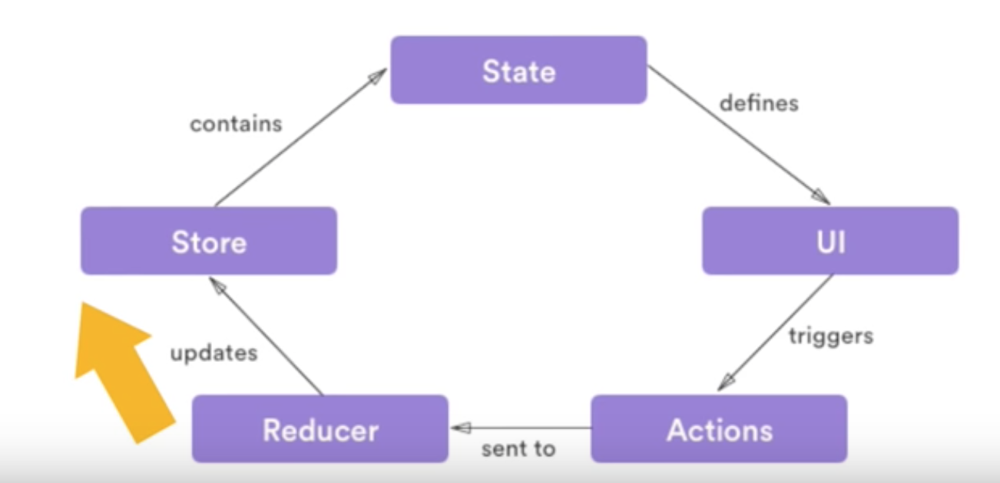
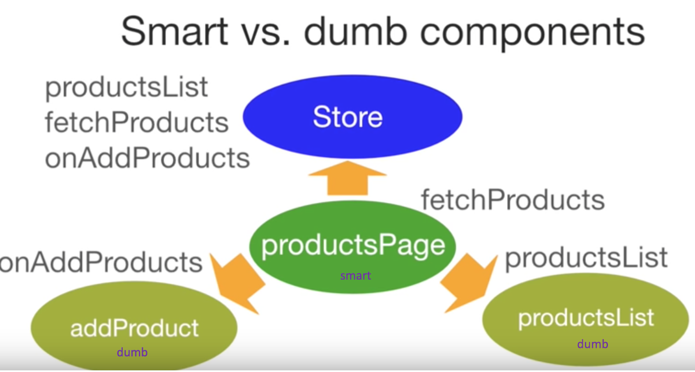

# React - Redux

## Redux



```csharp

# Redux
--------
- The fundamental concepts in Redux are called "stores" and "actions". 


# Store:
- A store has two parts: 
    - "state": It is a `object` that represents the current state of your application,
    - "reducer": It is a `function` that describes how incoming actions modify your state.


## Reducer: (pureFn)

- reducer receives both the current state and the action as parameters, and returns the modified state. 
- A well-written reducer should not have any side-effects, 
    - if you call a reducer with the same state and the same action, you should always get the same result. 
- Reducers should not modify or rely on any global state. 
- It's also good practice to encapsulate as much of your application logic as possible in reducers, 
    - That really helps, easier to test, debug, and refactor.


# Action:
- To mutate(change) the redux state, you need to dispatch an action. 
- "action" is the 2nd parameter that gets passed to the "reducer". 
- An action is an object that tells your reducer what happened (e.g. ADD_TODO, TOGGLE_TODO).
- action must have a 'type' property 
- // { type: 'ADD_TODO', payload: { name: 'Cook Dinner' } } 
- // { type: 'TOGGLE_TODO', payload: { id: '101' }  }

# Action Creators:
- pureFn: returns an action  (helper dn for returning an action)
- // () => ({ type: 'ADD_TODO', payload: { name: 'Cook Dinner' } })

# Async Action Creators:
-  by using some reduxMiddlewares (e.g. redux-thunk), 
    - an action creator can return a 'function' instead of an 'action object'.
-  it need not to be pureFn, it is allowed to have sideEffects
    - such as 'calling API' or 'calling any promise' or 'calling multiple dispatcher before/after API calls'
    

# Selectors:
- TODO


```



















## 

## Reselect

