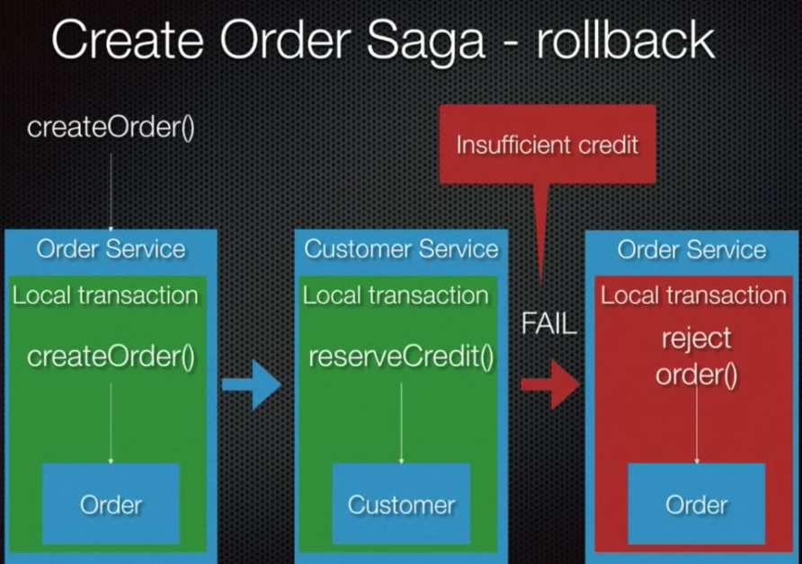
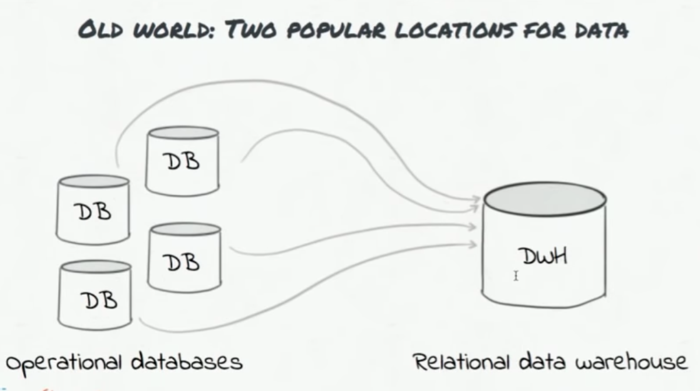

# Distributed Transactions

## Data Consistency

### Data Consistency Problems in Microservice & How 'Saga' helps





### Business Criteria

But

### Microservice

### Microservice DataConsistency

#### Recommended Solutions:

### 1. Use 'Table' & `Keep Polling the Table` -to Publish the Msg

### 2. Use 'Table' & `Tail DB Logs` --to Publish the Msg

### Data Consistency Problems \(more..\)
























Not everywhere we need Data Consistency

For example, \(Here we may have Data Inconsistency

1. In online shopping website
   1. Sometimes you see, Data Inconsistency
   2. For example, In search page, **Item shows Available**
   3. But actually if you click that **Item details** and see it shows **"Not Available"**
2. 











## Kafka

### What is Kafka



ss



### Why Kafka



