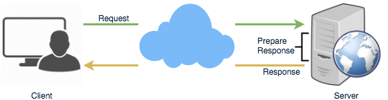

# Polling vs WebSockets vs Server-Sent Events

```fsharp
# Client-Server Protocols
- Simple HTTP

// To get RealTime updates,
- AJAX Polling // client repeatedly polls requests to Server (for RealTime data)
- Web Socket // TwoWayCommunication: Client <--> Server
- Server Sent Events (SSEs) // OneWayCommunication: Client <-- Server
```

## Simple HTTP

* First, let’s start with understanding what a standard HTTP web request looks like

  1. The client opens a connection and requests data from the server.
  2. The server calculates the response.
  3. The server sends the response back to the client on the opened request.



## Ajax Polling

Polling is a standard technique used by the vast majority of AJAX applications. The basic idea is that the client repeatedly polls \(or requests\) a server for data. The client makes a request and waits for the server to respond with data. If no data is available, an empty response is returned.

1. The client opens a connection and requests data from the server using regular HTTP.
2. The requested webpage sends requests to the server at regular intervals \(e.g., 0.5 seconds\).
3. The server calculates the response and sends it back, just like regular HTTP traffic.
4. The client repeats the above three steps periodically to get updates from the server.

The problem with Polling is that the client has to keep asking the server for any new data. As a result, a lot of responses are empty, creating HTTP overhead.Ajax Polling Protocol


####  <a id="div-stylecolorblack-background-colore2f4c7-border-radius5px-padding5pxhttp-long-pollingdiv"></a>

## WebSockets

WebSocket provides [Full duplex](https://en.wikipedia.org/wiki/Duplex_%28telecommunications%29#Full_duplex) communication channels over a single TCP connection. It provides a persistent connection between a client and a server that both parties can use to start sending data at any time. The client establishes a WebSocket connection through a process known as the WebSocket handshake. If the process succeeds, then the server and client can exchange data in both directions at any time. The WebSocket protocol enables communication between a client and a server with lower overheads, facilitating real-time data transfer from and to the server. This is made possible by providing a standardized way for the server to send content to the browser without being asked by the client and allowing for messages to be passed back and forth while keeping the connection open. In this way, a two-way \(bi-directional\) ongoing conversation can take place between a client and a server.


## `Server-Sent Events (SSEs)`

Under SSEs the client establishes a persistent and long-term connection with the server. The server uses this connection to send data to a client. If the client wants to send data to the server, it would require the use of another technology/protocol to do so.

1. Client requests data from a server using regular HTTP.
2. The requested webpage opens a connection to the server.
3. The server sends the data to the client whenever there’s new information available.

SSEs are best when we need real-time traffic from the server to the client or if the server is generating data in a loop and will be sending multiple events to the client.


